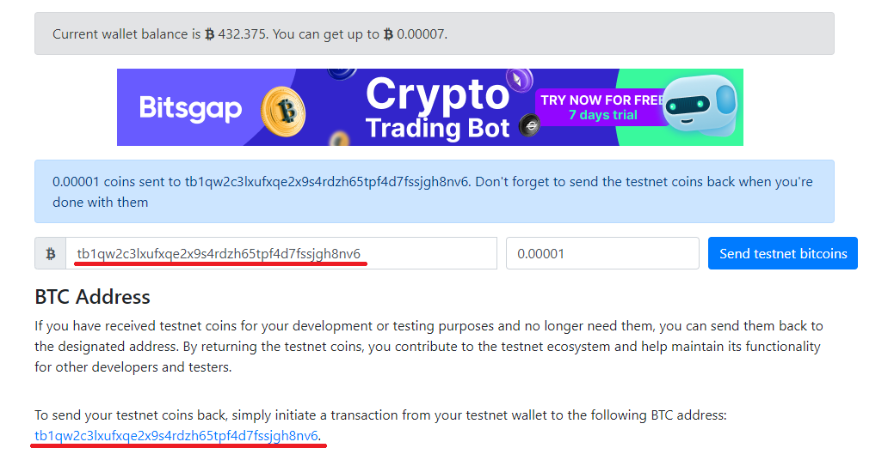

# 제 1장 처음 접하는 블록체인
## 비트코인 개발환경 세팅
### 비트코인 클라이언트 설치
```
wget https://bitcoincore.org/bin/bitcoin-core-0.15.2/bitcoin-0.15.2-x86_64-linux-gnu.tar.gz
```
```
tar xzf bitcoin-0.15.2-x86_64-linux-gnu.tar.gz*
```
```
sudo install -m 0755 -o root -g root -t /usr/local/bin bitcoin-0.15.2/bin/*
```

### 비트코인 클라이언트 설치(최신버전)
```
sudo apt-add-repository ppa:bitcoin/bitcoin
```
```
sudo apt-get update
```
```
sudo apt-get install bitcoin-qt bitcoind
```

### 일렉트럼(경량 지갑) 설치
```
wget https://download.electrum.org/3.3.4/Electrum-3.3.4.tar.gz
```
```
sudo apt-get install python3-setuptools python3-pyqt5 python3-pip
```
```
sudo pip3 install Electrum-3.3.4.tar.gz
```

## 비트코인 코어 실행
### bitcoin.conf 파일 생성
```
mkdir ~/.bitcoin
```
```
nano ~/.bitcoin/bitcoin.conf
```
### bitcoin.conf 파일에 아래의 내용 작성
```
rpcuser=user_name           #JSON-RPC 연결에 사용할 사용자 이름
rpcpassword=your_password   #JSON-RPC 연결에 사용할 패스워드
server=1                    #JSON-RPC 명령 실행을 위한 서버 활성화
testnet=1                   #실제 비트코인 네트워크 대신 시험용 네트워크에서 실행
prune=550                   #가지치기 모드 활성화
```
### 비트코인 코어의 GUI 버전 실행
```
bitcoin-qt
```
### 비트코인 코어의 CLI 버전 실행(비트코인 데몬)
```
bitcoind
```
### 비트코인 코어 디렉터리 파일 설명
| 파일명     | 설명                                                                  |
| ---------- | --------------------------------------------------------------------- |
| blocks      | 실제 비트코인 블록들이 여기에 저장된다.                               |
| chainstate | 사용 가능한 UTXO들에 대한 LevelDB 데이터베이스가 여기에 저장된다.     |
| wallet     | 개인 키들이 저장된 wallet.dat 파일을 암호화한 버전이 여기에 저장된다. |

### 새 주소 생성 (비트코인 서버가 실행중이어야함)
```
bitcoin-cli getnewaddress
```
## 일렉트럼 실행
### 일렉트럼 시험망 모드 실행
```
electrum --testnet
```
- 첫 대화상자에서 Auto Connect를 선택하고 Next 버튼을 클릭한다
- Standard wallet을 선택하고 Next 버튼을 클릭한다
- "Your wallet generation seed is."라는 문구가 있는 화면이 나올 때까지 계속 Next 클릭
- 텍스트 상자에 표시된 단어들이 암기하여 Confirm Seed 화면에 정확히 입력한다.
- 패스워드는 따로 지정하지 않고 넘어가도 된다.
- 마지막으로 Next 버튼을 클릭해서 마법사를 종료하면 다수의 새 주소들과 함께 지갑이 생성된다.
- 일렉트럼 GUI를 종료하고 이제부터는 CLI모드를 사용한다 다음 명령들을 실행해서 시험망용 일렉트럼 데몬을 띄운다.
```
electrum --testnet daemon start
```
```
electrum --testnet daemon load_wallet
```
- 이제 새 터미널 창을 열고 아래의 명령어를 입력한다.
```
electrum --testnet listaddresses
```
## 주소에 자금 추가
### 비트코인 수도꼭지 추가
http://bitcoinfaucet.uo1.net/
### 우리 주소에 자금 추가
